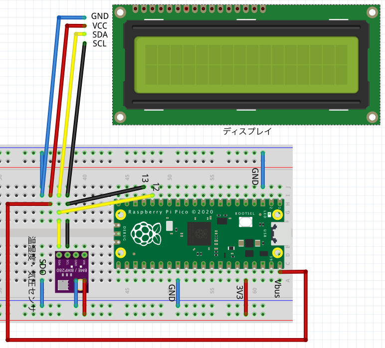
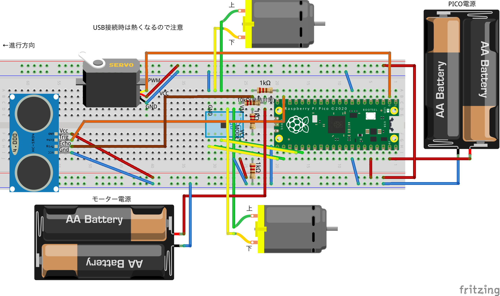

# Raspberry Pi Pico
raspberry pi picoを利用した工作プログラム

- 気温・湿度・気圧の表示ツール
- 自動運転車

## How to use
1. ブートモードでUF2ファイルを書き込む
2. `main.py`, `src/`を書き込む
3. 必要に応じてパッケージ(`lib/`)を追加
4. `main.py`を実行

## Examples
### 気温・湿度・気圧の表示ツール

### 自動運転車

## Reference
- [【Raspberry Pi Pico】自動運転ロボットカーの製作　②回路・プログラム編](https://hellobreak.net/raspberry-pi-pico-auto-robot-car2/)
